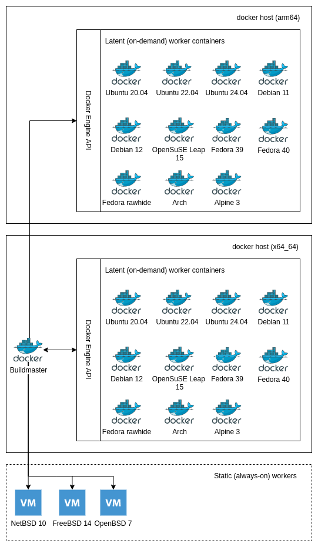

# Introduction

This is CI/CD system built on top of Buildbot. Here's an overview of the design
(details vary depending on the deployment):



This buildbot system can run on baremetal or virtualized. It depends on the
Docker Engine API for spinning up latent (on-demand) Buildbot workers. The
system should be mostly operating system agnostic, except for the provisioning
part which is currently Ubuntu-specific. 

This system as a whole has been tested on:

* Amazon EC2 Ubuntu 20.04 server instance (t3a.large, x86_64)
* Amazon EC2 Ubuntu 22.04 server instance (t3a.large, x86_64)
* Amazon EC2 Ubuntu 23.10 server instance (t3a.large, x86_64)
* Amazon EC2 Ubuntu 24.04 server instance (t3a.large, x86_64)

Worker containers have additionally been tested on:

* Amazon EC2 Ubuntu 24.04 server instance (m7g.large, arm64)

The system is known to work without issues with 8GB of memory, but could potentially run with less if build concurrency is kept small.

# Setup

The first step is to create a provision.env file:

    $ cd openvpn-buildbot/buildbot-host
    $ cp provision-default.env provision.env

Modify *provision.env* to look reasonable. For example in AWS EC2 you'd
use something like this:

    VOLUME_DIR=/var/lib/docker/volumes/buildmaster/_data/
    WORKER_PASSWORD=mysecretpassword
    DEFAULT_USER=ubuntu

Then provision the environment:

    /full/path/to/buildbot-host/provision.sh

The provisioning script will build Buildbot Worker containers, the Buildmaster
container and create dummy t_client and Authenticode certificates. The dummy
certificates will suffice unless you are going to run t_client tests or do
Windows code signing.

After provisioning you need to create a suitable *master.ini* file based on
*master-default.ini*. A few changes should be made:

* Ensure that email addresses are valid or buildmaster will fail to start
* Ensure that repository URLs are pointing to a reasonable place (e.g. your own forks on GitHub)
* Ensure that max_builds parameter points to valid Docker hosts

After changing master configuration you need to rebuild the buildmaster container:

    cd /full/path/to/buildbot-host
    ./rebuild.sh buildmaster

Then launch the buildmaster container. This stops and removes the old instance
(if any) in the process:

    cd /full/path/to/buildbot-host/buildmaster
    ./launch.sh v2.6.1

Make sure that you're using the correct image tag, see *MY_VERSION* in the
[Dockerfile](buildbot-host/buildmaster/Dockerfile).

Buildbot master should now be listening on port 8010.

# Supported build types

## openvpn

* Basic Unix compile tests using arbitrary, configurable configure options
* Server tests with t_server_null.sh (see OpenVPN Git repository)
* Unix connectivity tests using t_client.sh (see OpenVPN Git repository)
* Native Windows builds using MSVC to (cross-)compile for x86, x64 and arm64 plus MSI packaging and signing. Not actively tested.
* Server tests using t_server_null.sh
    * Git master client -> Git master servers
    * Git release/2.6 client -> Git master servers
    * Git release/2.5 client -> Git master servers
* Debian/Ubuntu packaging

## openvpn3

* Compile tests against OpenSSL and stable releases of ASIO

## openvpn3-linux

* Compile tests with standard settings

## ovpn-dco

* Compile tests against the operating system's default kernel

## Relevant files and directories under buildbot-host:

The buildbot-host directory contains a number scripts for settings up a
buildmaster.  The following script are used internally and typically you would
not touch them:

* *provision.sh*: used to set up the Docker host
* *create-volumes.sh*: create or recreate Docker volumes for the buildmaster and workers

Most of the time you'd be using these scripts:

* *rebuild.sh*: rebuild a single Docker image
* *rebuild-all.sh*: rebuild all Docker images
* *buildmaster/launch.sh*: launch the buildmaster

If you want to experiment with static (non-latent) Docker buildbot workers you
may also use:

* *launch.sh*: launch a buildbot worker

Here's a list of relevant directories:

* *buildmaster*: files, directories and configuration related to the buildmaster
    * *authenticode.pfx*: your Windows code signing key (ignored by Git, must be copied to correct place manually)
    * *master-default.ini*: global/buildmaster settings (Git repo URLs etc). Does not get loaded if *master.ini* (below) is present.
    * *master.ini*: local, unversioned config file with which you can override *master-default.ini*.
    * *worker-default.ini*: buildbot worker settings. The \[DEFAULT\] section sets the defaults, which can be overridden on a per-worker basis. Does not get loaded if *worker.ini* (below) is present.
    * *worker.ini*: local, unversioned config file with which you can override *worker-default.ini*.
    * *master.cfg*: buildmaster's "configuration file" that is really just Python code. It is solely responsible for defining what Buildbot and its workers should do.
    * *debian*: this directory contains all the Debian and Ubuntu packaging files arranged by worker name. During Debian packaging builds the relevant files get copied to the Debian/Ubuntu worker.
    * *openvpn*: files containing the build steps for openvpn (OpenVPN 2.x)
    * *openvpn3*: files containing the build steps for openvpn3 (OpenVPN 3.x)
    * *openvpn3-linux*: files containing the build steps for openvpn3-linux
    * *ovpn-dco*: files containing the build steps for ovpn-dco
* *buildbot-worker-\<something\>*: files and configuration related to a worker
    * *Dockerfile.base*: a "configuration file" that contains ARG entries that will drive the logic in the main Dockerfile, *snippets/Dockerfile.common*. Used when provisioning the container.
    * *env*: sets environment variables that are required by the worker container (buildmaster, worker name, worker pass). Used when launching *static* containers. Not needed for *latent* worker containers. In other words, in most cases you can ignore the *env* file.
    * *ec2.pkr.hcl*: Packer code to build EC2 latent buildbot workers
* *aptly*: files related to Debian/Ubuntu package publishing using aptly; see [buildbot-host/aptly/README.md](buildbot-host/aptly/README.md) for details
* *scripts*: reusable worker initialization/provisioning scripts
* *snippets*: configuration fragments; current only the reusable part of the Dockerfile

# The Docker setup

This Docker-based environment attempts to be stateless and self-contained.
While all the containers have persistent volumes mounted on the host, only
buildmaster actually utilizes the volume for anything (storing the worker
password and the sqlite database). The worker containers are launched on-demand
and get nuked after each build. On next build everything starts from scratch.

Build artefacts can be copied from the workers to the buildmaster before the
worker exits, or copied elsewhere during build.

The containers (master and workers) do not require any data to be present on
the persistent volumes to work. The only exception is the worker password that
needs to be in a file on buildmaster's persistent volume.

# Building and using additional Docker hosts.

It is possible to point the buildmaster to a remote Docker hosts on a
worker-by-worker basis. This can be useful, for example, to add builds for
additional processor architectures such as arm64.

The remote Docker host can be created like any buildmaster with provision.sh -
we just don't use the buildmaster container for anything. The Docker daemon on
the remote Docker host needs to listen on the appropriate network interface.
This can be accomplished with a systemd override such as this:

```
# /etc/systemd/system/docker.service.d/override.conf
[Service]
ExecStart=
ExecStart=/usr/bin/dockerd -H fd:// -H tcp://10.29.32.2:2375
```

For security reasons access to the Docker daemon should be limited to just the
Buildmaster, e.g. with iptables rules or EC2 security groups.

Once the remote Docker host is ready, you need to configure Buildbot workers.
For each worker you define which Docker host the Buildmaster uses and which
Buildmaster (from its perspective) the worker connects to. Here's an example
from worker.ini:

```
[debian-11-arm64]
# Buildbot worker needs to know where the buildmaster lives
master_fqdn=10.29.32.1

# Buildmaster needs to know which docker host to instantiate the container on
docker_url=tcp://10.29.32.2:2375

# This refers to the name of the image running on the docker host (here:
10.29.32.2)

image=openvpn_community/buildbot-worker-debian-11:v1.0.3
```

The worker-default.ini file has example arm64 workers configured already.

# Configuring build concurrency on Docker hosts

The maximum number of concurrent builds needs to be configured using a JSON
dictionary in master.ini:

```
[docker]
max_builds={ "172.18.0.1": 4, "10.29.32.2": 4 }
```

The keys must be IP addresses or hostnames. Each key must be present in worker.ini
as part of a docker_url. For example:

```
[DEFAULT]
docker_url=tcp://172.18.0.1:2375

[debian-11-arm64]
docker_url=tcp://10.29.32.2:2375
```

# Development

## Defining image version and name

The Dockerfile or Dockerfile.base used to build the images contains some
metadata encoded in Docker's ARG parameter. This allows parameterless
image rebuild and container launch scripts. You should not change the image
metadata unless you have a specific reason for it: reusing the same tag will
simplify things.

## Building the docker images

Buildbot will not function properly if worker images have not bene built.
To (re)build a worker:

    cd buildbot-host
    ./rebuild.sh <worker-dir>

For example

    ./rebuild.sh buildbot-worker-ubuntu-2404

To build the master:

    ./rebuild.sh buildmaster

To rebuild all containers (master and workers):

    ./rebuild-all.sh

Due to docker caching you can typically rebuild everything in a few seconds if
you're just changing config files.

## Building latent EC2 workers with Packer

Certain workers such as windows-server-2019-latent-ec2 are built with Packer.
Sensitive information like passwords have to be defined on Packer command-line
or in environment variables. Here's an example of the latter approach:

    PKR_VAR_buildbot_windows_server_2019_worker_password=<buildbot-worker-password>
    PKR_VAR_buildbot_windows_server_2019_ec2_region=eu-central-1
    PKR_VAR_buildbot_windows_server_2019_buildbot_user_password=<buildbot-windows-user-password>
    PKR_VAR_buildbot_authenticode_cert=<authenticode-certificate-file-path>
    PKR_VAR_buildbot_authenticode_password=<password-for-authenticode-certificate>
    PKR_VAR_buildmaster_address=<buildmaster-ip-address>
    PKR_VAR_buildbot_windows_server_2019_winrm_password=<windows-admin-password>

To build the image use

    packer build ec2.pkr.hcl

It is assumed of course that you have configured AWS and Packer properly.

## Changing buildmaster configuration

Buildmaster has several configuration files:

* *master.cfg*: this is the Python code that drives logic in Buildbot; it should have as little configuration it is as possible
* *master-default.ini*: the default master configuration, contains Docker and Git settings
* *master.ini*: overrides settings in master-default.ini completely, if present
* *worker-default.ini*: the default worker configuration, contains a list of workers and their settings
* *worker.ini*: overrides settings in worker-default.ini completely, if present

You should copy *master-default.ini* and *worker-default.ini* as *master.ini*
and *worker.ini*, respectively, and adapt them to your needs.

It is possible to do rapid iteration of buildmaster configuration. For example:

    vi buildmaster/master.cfg
    ./rebuild.sh buildmaster

Then from the "buildmaster" subdirectory:

    ./launch.sh v2.6.1

# Stable and rolling release distros

Most of the latent Docker workers are based on stable distribution, meaning
that their package versions remain the same and only small patches are applied
on top. These are what most normal people use.

Some workers are based on rolling release distros, though. If the Docker images
are rebuilt regularly these distros help us spot build issues early on.

# Debugging

## Worker stalling in "Preparing worker" stage

If your workers hang indefinitely at "Preparing worker" stage then the problem
is typically one of the following:

1. Broken container image
1. Connectivity issue between Buildmaster and Docker host
1. Connectivity issue between Buildbot Worker and Buildmaster

## Debugging build or connectivity test issues

Probably the easiest way debug issues on workers (e.g. missing build
dependencies, failing t_client tests) is to just add a "sleep" build step to
master.cfg right after the failing step. For example:

    factory.addStep(steps.ShellCommand(command=["sleep", "36000"]))

This prevents buildmaster from destroying the latent docker buildslave before
you have had time to investigate. To log in to the container use a command like
this:

    docker container exec -it buildbot-ubuntu-2404-e8a345 /bin/sh

Check "docker container ls" to get the name of the container.

## Simulating always-on buildbot workers

Buildbot launches the docker workers on-demand, so there are only two use-cases for non-latent always-on docker workers:

* Initial image setup: figuring out what needs to be installed etc.
* Simulating always-on workers: this can be useful when developing master.cfg

The always-on dockerized workers get their buildbot settings from \<worker-dir\>/env that
you should modify to look something like this:

    BUILDMASTER=buildmaster
    WORKERNAME=ubuntu-2404-alwayson
    WORKERPASS=mysecretpassword

You also need to modify buildmaster/worker.ini to include a section for your
new always-on worker:

    [ubuntu-2404-static]
    type=normal

Then rebuild and relaunch buildmaster as shown above. Now you're ready to launch your new worker manually:

    cd buildbot-host
    ./launch.sh <worker-dir>

For example:

    ./launch.sh buildbot-worker-ubuntu-2404

## Wiping Buildmaster's database

Buildmaster's database can fairly easily get into a strange state when Buildmaster configuration is modified heavily. Fortunately it is typically just fine to destroy the Buildmaster database to clean things up:

    sudo rm /var/lib/docker/volumes/buildmaster/_data/libstate.sqlite

The only caveat is that you'll lose information about old builds.
